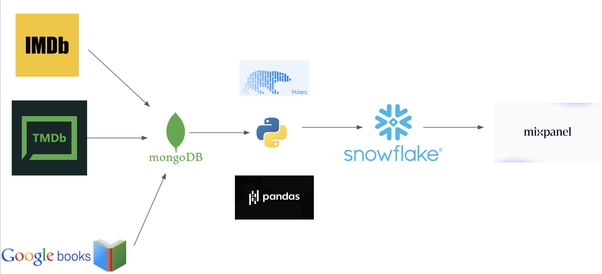
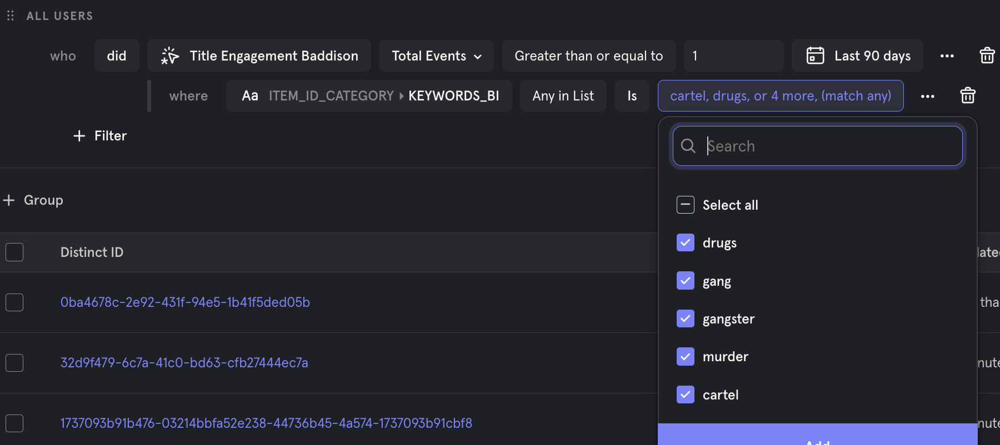
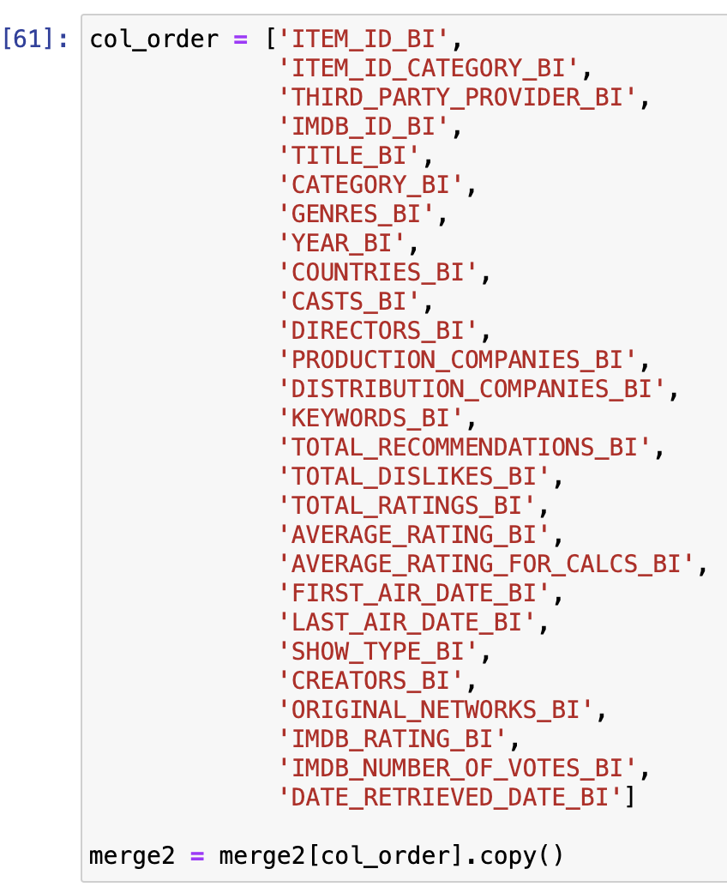
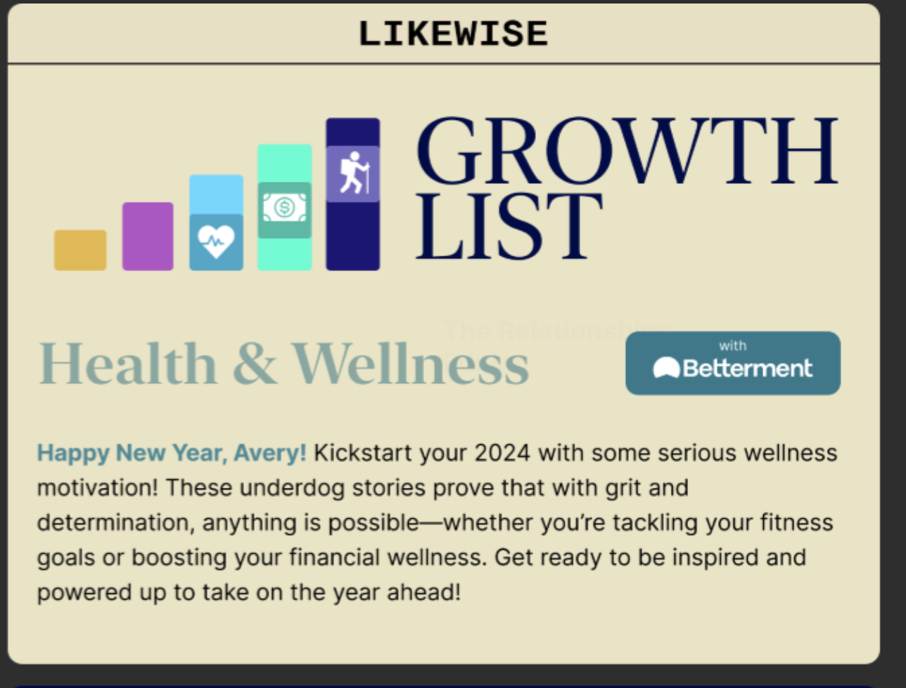

# growing_revenue

I led projects that were directly tied to growing a client from a 5-figure test campaign to multiple 6-figure deals.

### 1) The lynch-pin of the first 5-figure test campaign was being able to identify users in our base that had interest in specific topics. Identifying these users was possible bc of a project that:
- Extracted genre, topic and keyword from iMDB, TMDB and google books
- Transforming data into dimension tables 
- Pushing the resulting dimension table to mixpanel for easy joining to user profiles

&nbsp;

 - Say we were working with a partner that wanted to promote a title that was similar to "Narcos". We can then very quickly start to build a cohort of users interested in topics and themes like that in Narcos:

&nbsp;

- The jupyter notebook in this repo contains moderately-cleaned code I made to munge thru the data to produce the dimension table I needed.
    - indentifying and removing duplicates
    - dealing with id and title mismatches
    - joining data from multuple sources
    - merging and deduping values in lists
- Resulting data set contains all the information below for sorting, filtering and audience creation based on interests.

&nbsp;

### 2) I determined that media placements in our newsletters were leading to eCPA's for the client that were 25% below their expected. (Not described in detail in this repo)

&nbsp;

### 3) To help grow revenue from this client, I conceptualized and named a custom product.
- The concept broadly speaking was "health, wellness & personal-development"
- Identified over 1.5M users with interest in this topic (using the data provided in step 1)
- Coined the name "Growthlist" for the custom product which was ultimately the winning idea. Designs shown below.

